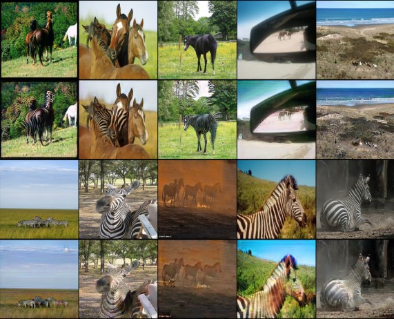
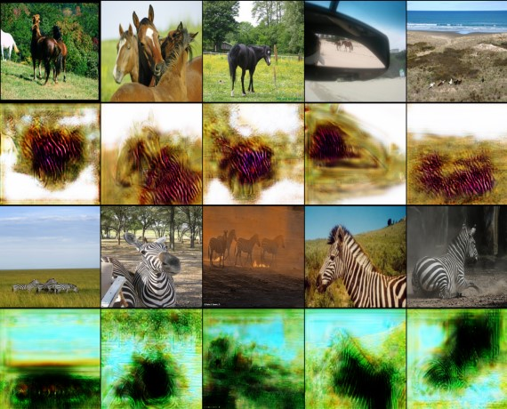

# Projet Deep : Transfert de style via CycleGan
Auteur :
- BOURBON Elodie
- EL KAOUT Amine
- MERCIER Loris
- SIMOUD Achour

## Introduction
Ce projet a pour objectif de réaliser un transfert de style sur une courte vidéo. Pour cela, nous avons utilisé un modèle de CycleGan. *Lire la suite dans le [rapport](rapport.pdf)*

